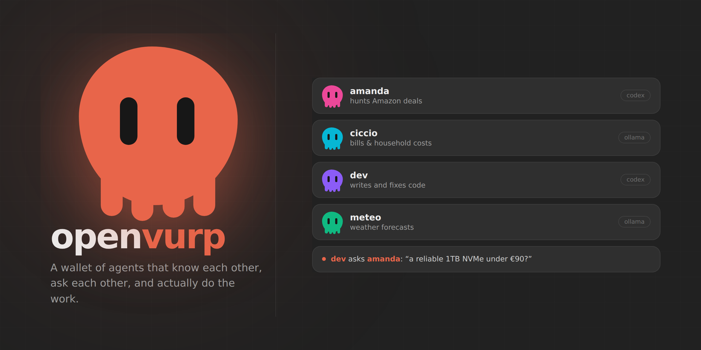

<p align="center">
  
</p>

<p align="center">
  <a href="LICENSE"></a>
  
  
  
  
</p>

# openvurp

openvurp is a self-hosted runtime for **personal AI agents that do real work on
your machine** — run shell commands, read and write files, search and fetch the
web, drive a browser, watch folders — and that **know about each other** well
enough to hand a question to the right colleague without you routing it.

It runs on your own hardware, with a local model (Ollama, LM Studio, llama.cpp,
anything speaking the OpenAI API) or a cloud one, chosen per agent. The
conversations, the memory and the identities live in `memory/` on your disk and
go nowhere you did not configure.

Typing `openvurp` opens a page in your browser. That page is the product.

```
you   → my SSD is dying, what should I get?

dev   ⚙ shell   smartctl -A /dev/nvme0n1
      → 187 reallocated sectors, and climbing. Back up today.
      ⇉ asks amanda: a reliable 1TB NVMe under €90?

amanda → Crucial P3 Plus 1TB, €74, shipped by Amazon.

dev   → So: Crucial P3 Plus, €74. Back up before you swap it.
```

Nothing there was scripted. `dev` ran a real command against a real disk,
decided on its own that the purchase was not its field, and found `amanda`
because every agent carries the roster — names and trades — inside its own tools.

---

## Install and run

```bash
git clone https://github.com/openvurp/openvurp && cd openvurp
python3 -m pip install -e ".[dev]"
openvurp
```

The first launch runs a **setup wizard**: engine, model, and optionally a
Telegram token. It writes `.env` for you and refuses to boot half-configured —
an agent with no model is a page that does nothing.

Then `openvurp` opens the wallet at **http://localhost:8420**.

| command | what it does |
|---|---|
| `openvurp` | the wallet in the browser (the normal way) |
| `openvurp --cli` | the terminal interface instead |
| `openvurp --headless` | services only: no browser, no terminal UI |
| `openvurp --setup` | run the wizard again |
| `openvurp --doctor` | check the runtime and report what is broken |

### With Docker

```bash
docker compose up -d                       # wallet on http://localhost:8420
docker compose exec openvurp openvurp      # the terminal, inside the container
```

The image starts headless: wallet, gateway, inbound channels, heartbeat. It
reaches Ollama on the host through `host.docker.internal`, and `memory/` is a
named volume, so restarting the container does not cost you the agents' history.
WhatsApp is the one channel not in the image — its bridge needs Node.

### As a service

```bash
sudo bash scripts/install-service.sh   # systemd, Restart=always
journalctl -u openvurp -f
```

Close every terminal, reboot the machine: the agents keep running and the page
is still there. A **sentinel** watches the network and the model backend from
inside — when something falls it tells you, and when it comes back it wakes the
work that was suspended.

---

## What the page contains

**A roster, on the left.** It starts empty. There are no sample agents and no
personas shipped with the product: you create the first one yourself, giving it
a name, a job and an engine. The job matters more than it looks — write *"hunts
Amazon deals"* and that sentence is what the other agents read when they are
deciding who to ask.

**One conversation per agent**, kept in `memory/chats/chats.db` and still there
after a restart.

**A room called "All together"**, where they answer each other instead of in
parallel. See [The room](#the-room).

**What they are doing, while they do it.** Tokens as they stream, every shell
command and search at the moment it runs, and two avatars that visibly walk
across to each other when one consults the other. A file an agent produces — a
PDF, a page, an image — opens in a card beside the chat instead of landing in
your downloads folder.

**Permission requests where you asked for the action.** If you started something
from the browser, the question appears in the browser. Nothing waits for an
answer in a terminal you are not looking at, and no answer means no.

**Voice.** A microphone in the composer, or a full conversation mode where the
agent speaks as soon as its first sentence is ready — each with a different
voice, so you hear when a different one takes over.

**Settings on their own page** (the gear, bottom left): engine, subscriptions,
channels, local servers. The choices are menus built from what is actually
installed and reachable, not fields where you type a model name from memory.

---

## What an agent actually is

Not a system prompt with a name on it. Each one runs the whole runtime:

**Tools.** Shell, files, web search and fetch, a real browser, processes, media
(PDF, images, audio), notifications. Called natively where the backend supports
it; the read-only ones run in parallel.

**Approvals.** Three postures — `safe` asks, `auto` pre-approves the
non-critical, `plan` only observes and proposes. Saying *always* creates a lease
scoped to that tool and command prefix, for eight hours, revocable. Destructive
shell commands (`rm -rf /`, `dd`, `mkfs`, fork bombs) are refused in every
posture, `auto` included.

**Memory.** Files on disk, plus semantic memory (vectors and FTS5). At night the
heartbeat consolidates the day's notes into durable facts, writes a diary entry
in the first person, and runs a **dreaming** pass over the week looking for
patterns worth keeping.

**Identity.** Markdown files (`SOUL.md`, `IDENTITY.md`, `USER.md`) are the seed,
reloaded from disk every turn — editing one is live on the next message. Once
the **anima** holds real traits, each with an origin, an age, a version and its
own history, it replaces those files in context.

**Learning you can check.** A correction you give becomes a test case, replayed
later. `/growth` reports the numbers: lessons promoted with their evidence,
corrections no longer repeated, what was rolled back when it stopped holding.

**Pacts.** Rules you negotiate once (*never touch that folder*) and the runtime
enforces on every tool call, above every posture.

**The Forge.** When the task exceeds the toolbox, the agent scaffolds a new
tool, tests it, and only then promotes it to a reusable plugin.

**Subagents.** Real parallel work, not parallel text: they run tools and tests
and report back.

---

## The room

Writing in **All together** starts a discussion, not a broadcast. Everyone reads
what was said before them and answers it by name.

It ends by itself when a whole round passes with nobody adding anything —
repeating yourself counts as silence, not as a turn. Or you press **Stop**,
which never cuts a sentence in half; it stops handing out the floor.

Then whoever opened the discussion writes the landing: what was agreed, what was
not, who thinks otherwise, and what would settle it. Announcing a consensus
nobody reached is forbidden, and *"we did not decide"* is a valid ending.

Bounded by `MULTIPLAYER_MAX_AGENTS`, `MULTIPLAYER_MAX_ROUNDS` and
`MULTIPLAYER_DAILY_CALL_BUDGET`. When a limit is hit the room says so — openvurp
never answers in an agent's place, least of all when your budget ran out.

---

## Channels

Telegram, Discord, Slack and WhatsApp reach the same agents from your phone. The
adapters carry no logic of their own: they translate an incoming message into a
call to **the same function the web page calls**, and send back what comes out.
A test fails if any file under `channels/` reaches for the roster, the rooms or
the swarm by itself.

A chat has no sidebar, so there is a small shared grammar:

```
@amanda find me an SSD     ask one agent
amanda                     a bare name: from now on you are talking to her
/agents                    who is in the roster
/all what do you think?    put it to the whole room
/stop                      stop the discussion
/me                        back to talking to openvurp itself
/help                      this list
```

Turn them on with `CHANNELS_IN=telegram,discord`. **Every channel needs its own
allow-list** (`TELEGRAM_ALLOWED_USERS`, `DISCORD_ALLOWED_USERS`, …): an empty one
means nobody, and the channel refuses to start rather than open your machine to
the world. Strangers get silence, not a refusal — they are not told the bot
exists.

Telegram needs no extra package. Discord needs `openvurp[discord]` and the
message-content intent. Slack needs `openvurp[slack]` with a bot token and an
app token, over Socket Mode, so no public address is required.

**WhatsApp** goes through **Baileys**, which speaks the WhatsApp Web protocol:
you pair it by scanning a QR code from the Settings page. It needs Node.js, and
comes with one honest warning, repeated where you switch it on — **Baileys is
unofficial, Meta detects unofficial clients and can ban the number.** Use a
spare number.

Separately from all of this, and useful even with every channel off: set
`TELEGRAM_TOKEN` and `TELEGRAM_CHAT_ID` and openvurp writes *to* you — the
morning brief, "I'm done", a permission waiting for an answer.

---

## Engines

Every agent can run on a different one, chosen per conversation.

**Local.** Ollama has its own row. Anything else speaking the OpenAI API works
too — LM Studio, llama.cpp, vLLM, Jan, koboldcpp, GPT4All — and openvurp knocks
on the usual local ports for you: whatever answers appears in Settings as a
choice, with its models already listed.

**Subscription CLIs.** `codex login` with ChatGPT, or `claude` with Claude.ai,
run on the plan you already pay for. openvurp actively strips `OPENAI_API_KEY`
from their environment so they can never quietly fall back to metered billing.
Through Codex's App Server, openvurp's own tools are exposed as dynamic tools —
searches, files and processes are still executed by openvurp, under its
approvals and its audit log.

**APIs.** Anthropic, OpenAI, Groq, or any OpenAI-compatible endpoint. Each shows
as unavailable until its package and key exist.

**Automatic.** A local, free router: it does not call a model to decide which
model to use, and never picks Ollama or a separately billed API implicitly.

Token spending is bounded on purpose: tool schemas travel in packs rather than
all at once, history drops stale tool output, and every turn has a ceiling
(`TURN_TOKEN_BUDGET`, `CONTEXT_MAX_TOKENS`, `DAILY_LLM_BUDGET`).

---

## Security

Enforced by the runtime, not by asking the model nicely:

- **Sandbox** — file tools are confined to the workspace (`SANDBOX_MODE=restricted`); paths outside it are blocked unless listed in `SANDBOX_ALLOWED_PATHS`.
- **The page is local** — it binds to `127.0.0.1`. Exposing it (`DASHBOARD_HOST=0.0.0.0`, or Docker) requires a `DASHBOARD_TOKEN`, generated and enforced if you do not set one, so it is never reachable unauthenticated.
- **Untrusted content** — output from the web, PDFs, images and audio is wrapped in a marker telling the model it is data, not instructions. Secrets in outbound text and URLs are blocked from leaving.
- **RBAC and audit** — per-actor roles across tools and channels, every action logged.
- **Privacy router** (`PRIVACY_MODE=strict|auto`) — when the main backend is a cloud one, private sessions still run on a local model. Your memory does not leave the machine, by code rather than by promise.
- **Secret scanner** — `python3 scripts/secret_scan.py` fails on anything committable; the gitignored `.env` is reported as a note.

---

## Layout

```
main.py          startup, wizard, services
dashboard.py     the wallet: page, HTTP API, activity stream
TUI.py           the terminal interface

core/            agent loop and kernel · swarm (the roster, and how they
                 consult each other) · multiplayer (the room) · conversation
                 (the single core every channel goes through) · chat_store ·
                 approvals · anima · growth · mirror · diary · dreaming ·
                 curiosity · projects · senses · forge · pacts · heartbeat ·
                 sentinel · learning · memory (+vector) · privacy · safety ·
                 RBAC/audit/leases · subagents · model router · MCP · LLM client
tools/           shell · files · search · web · browser · processes · media ·
                 voice · notifications
channels/        telegram · discord · slack · whatsapp (Baileys) — transport only
skills/          markdown skills, loaded on demand
plugins/         drop-in tools
memory/          everything the agents lived: chats, lessons, diary, dreams
```

---

## Development

```bash
python3 -m pytest -q               # 578 tests
python3 scripts/secret_scan.py     # before any push
```

Direction lives in [ROADMAP.md](ROADMAP.md); how to report a vulnerability is in
[SECURITY.md](SECURITY.md).

---

## The name

*Vurp* means **octopus** in the dialect of Taranto. I named it after my hometown
and its sea — a small way of carrying a piece of where I come from into the
thing I build.

## License

[MIT](LICENSE)
